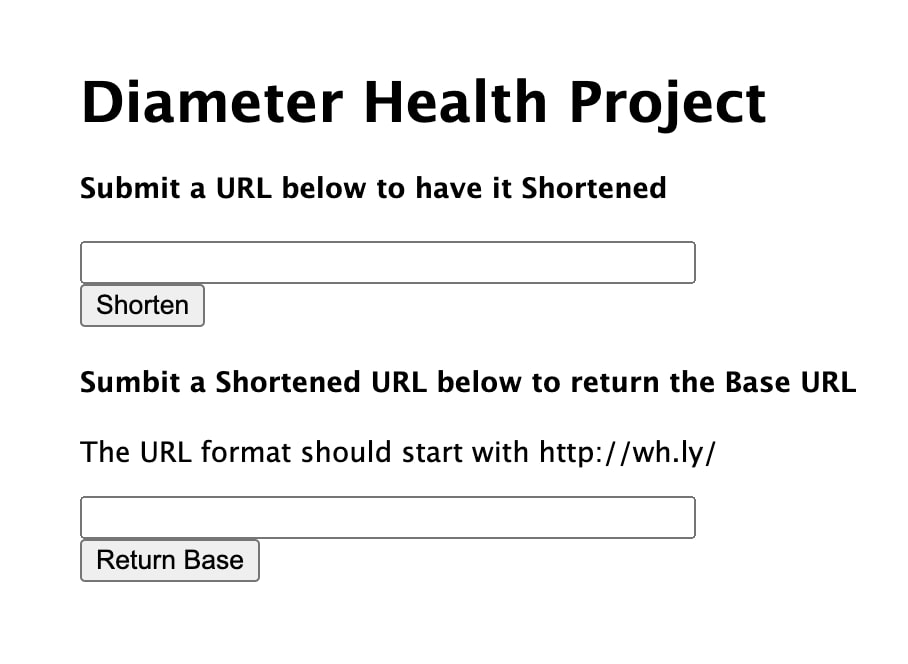

# Short URL Generator

### Short URL Generator is a web application that can receive a URL of any size through a UI and generate a “smaller” URL with the format of http://wh.ly/aaaaa. When this new URL is called, the original URL is returned.

## 

## Technologies Used
- HTML
- CSS
- Express.js
- Node.js
- MongoDB
- Mongoose

## Getting Started
- To begin running the application, please run `npm i` and `npm start`.
- Your console should then log `Connected to MongoDB`. If it does not, you may need to start your MongoDB server in a seperate terminal session by running `mongod`.
- Navigate to http://localhost:3000/ to view the web application.
- You can now use the two text inputs to shorten URLs and then later return the original URL.

## Next Steps
- In the future I'd like to explore the idea of building this application without the use of storage. My initial thoughts are that using cipher and decipher could be useful.
- I would like to add the proper response functionality so that the UI does not need to be used for the requests.
- While unlikley, it is possible that a new shortened URL could already exist in the database. I think implementing a recursive function within the `createUrl` function could help prevent this occurance.
- I will also note that if the original URL is already smaller than `http://wh.ly/aaaaa` in length, the application could actually slightly lengthen the URL.